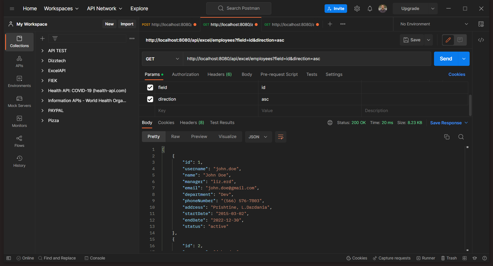
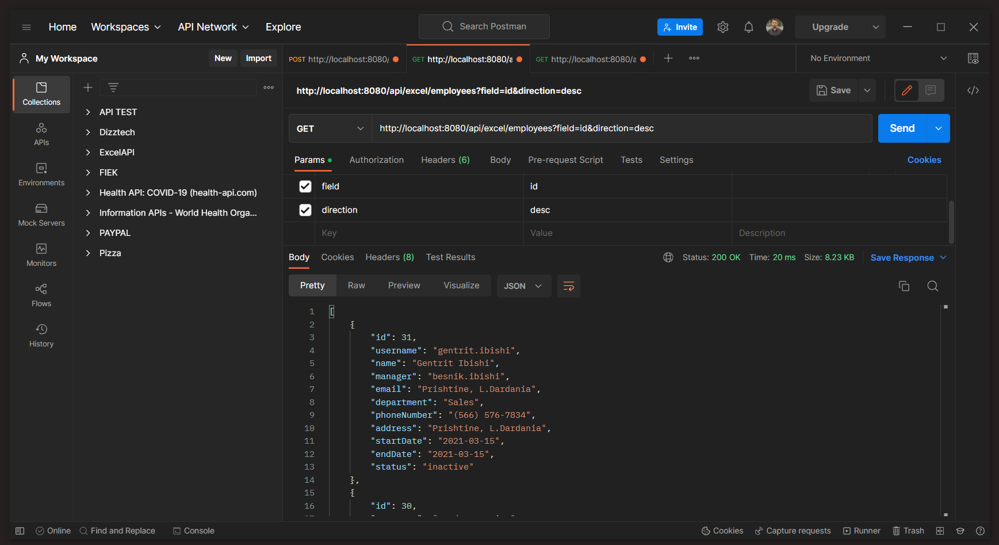
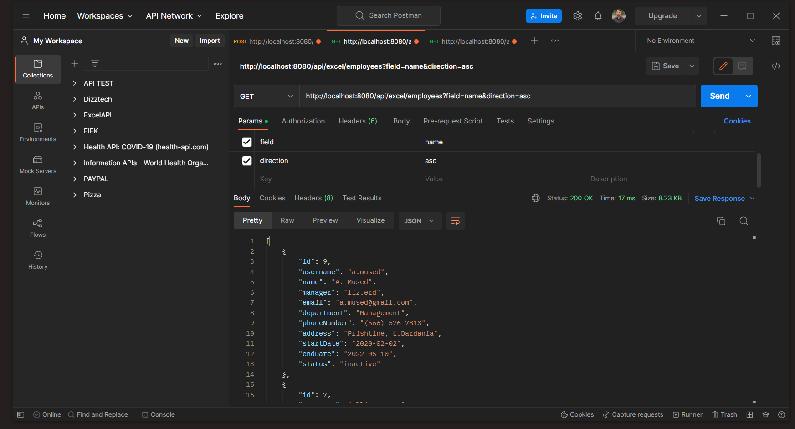
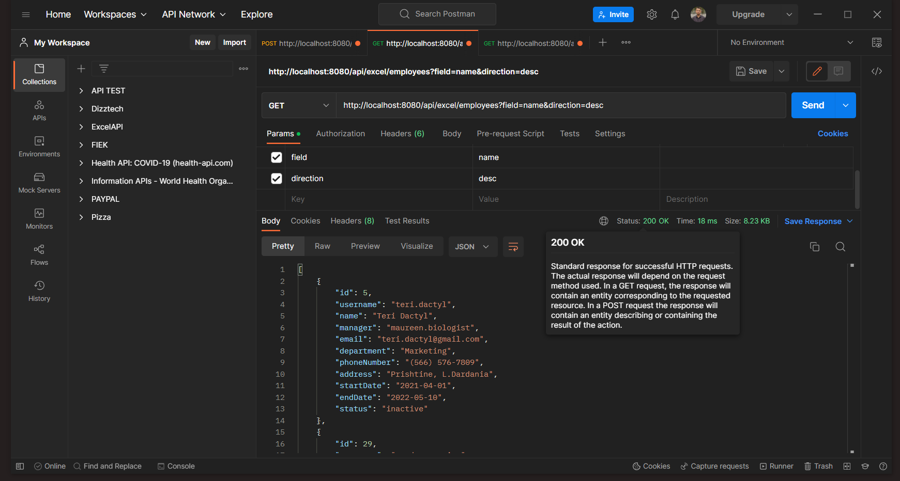
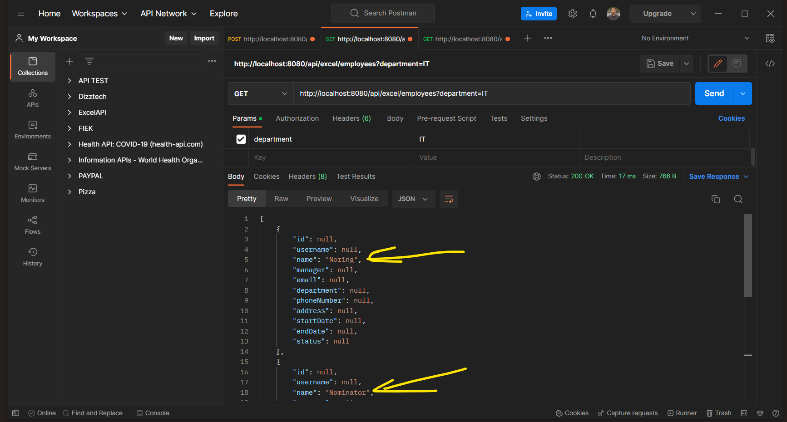
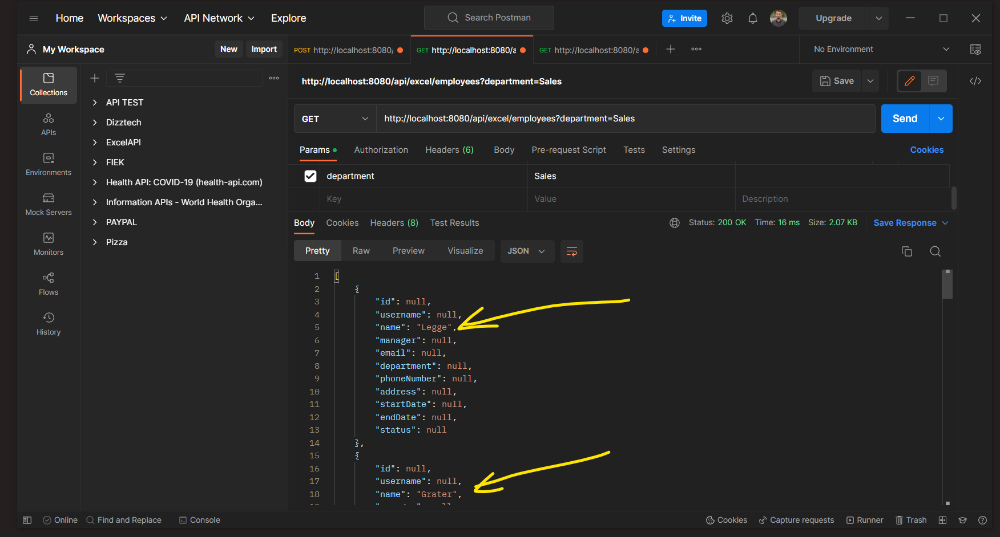
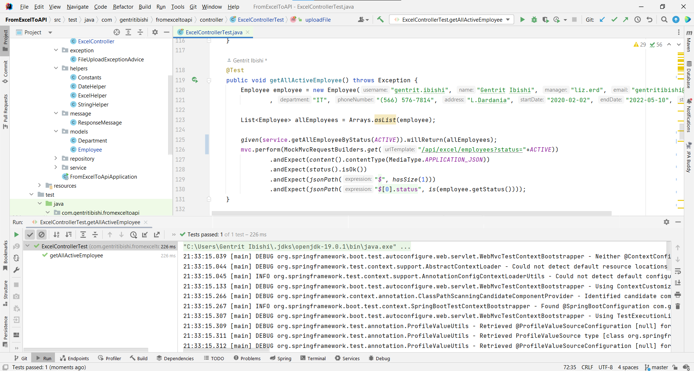
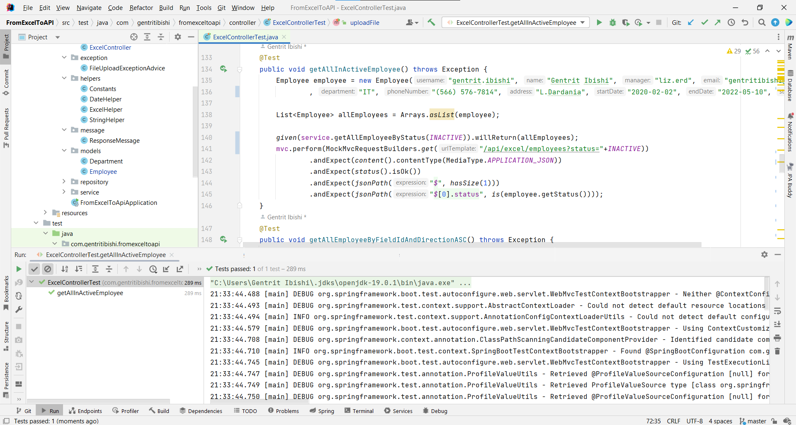

# FromExcelToAPI

Spring Boot Application - Import data from Excel to MySQL Database

## Features

* Excel file upload extension support " .xlsx ".
* The application before uploading to the database checks:

* * If it exists on the database
* * * It then checks for any modifications:

* * * * "Phone Number" column has been changed, then it updates that row with the last modification.

* * * * If it turns out that the row has not been modified then it does not insert it into the database as a duplicate.

* * If it does not exist on the database
* * * Then enter it directly into the base date..

### Screenshots Endpoints - METHOD URL ACTION

> POST /api/excel/upload Upload an Excel File and Insert Data into MySQL Database

#### First Time Request Uploading

 

> First Time Request - Department Table

 

> First Time Request - Employee Table

 
 

#### Second Time Request Uploading

 

> Second Time Request - Department Table

 

> Second Time Request - Employee Table

 
 

> GET	/api/excel/department Get List of departments in db table

 

> GET	/api/excel/employees	Get List of employees in db table

 

> GET	/api/excel/employees?status=active	Get List of employees active in db table

 

> GET	/api/excel/employees?status=inactive Get List of employees inactive in db table

 

> GET	/api/excel/employees?field=id&direction=asc Get List of employees in ascending by field

 

> GET	/api/excel/employees?field=id&direction=desc Get List of employees in descending by field

 

> GET	/api/excel/employees?field=name&direction=asc Get List of employees in ascending by field

 

> GET	/api/excel/employees?field=name&direction=desc Get List of employees in descending by field

 

> GET	/employees?department=IT Get List of last name of employees by department we want for ex: IT department.

> GET	/employees?department=Sales Get List of last name of employees by department we want for ex: Sales department.

 

### Unit test Screenshots

> Unit test - Uploading Dile - uploadFile()

 

> Unit test - Get all Departments - getAllDepartments()

 

> Unit test - Get all Employee - getAllEmployee()

 

> Unit test - Get all Active Employee - getAllActiveEmployee()

 

> Unit test - Get all InActive Employee - getAllInActiveEmployee()

 

> Unit test - Get all employee by field with sort ASC - getAllEmployeeByFieldWithSortASC()

 

> Unit test - Get all employee by field with sort DESC - getAllEmployeeByFieldWithSortDESC()

 

> Unit test - Get all employee by department - getAllEmployeeByDepartment()

 

### Requirements
* Java 17
* Apache POI Common dependency
* MySQL dependency
* Joda-time dependency
* JUnit Vintage Engine
* Hamcrest Core

## Installation
1. Press the **Fork** button (top right the page) to save copy of this project on your account.
2. Download the repository files (project) from the download section or clone this project by typing in the bash the following command:

       git clone https://github.com/GentritIbishi/FromExcelToAPI
3. Import it in Intellij IDEA or any other Java IDE and let Maven download the required dependencies for you.
4. Run the application 

* First page uploading file

 

* Success page after uploading file

 

## Contributing 💡
If you want to contribute to this project and make it better with new ideas, your pull request is very welcomed.
If you find any issue just put it in the repository issue section, thank you.

